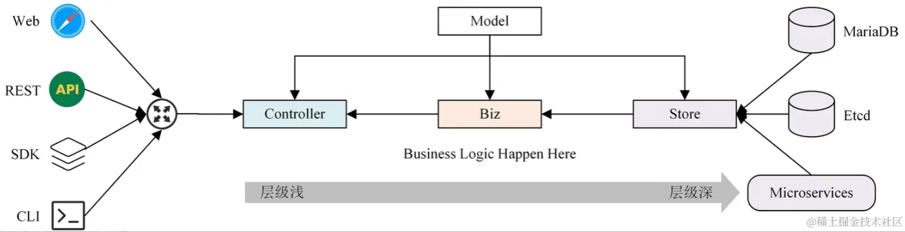
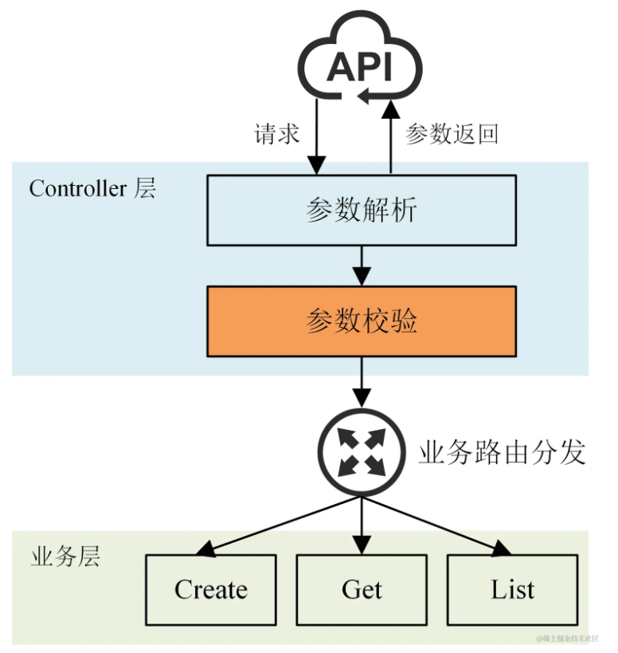
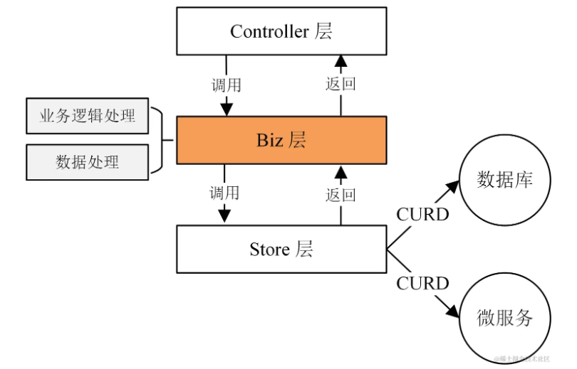
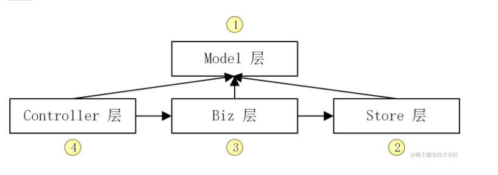

## miniblog 架构
miniblog 项目代码设计遵循简洁架构设计，一个简洁架构具有以下 5 个特性：

- **独立于框架**： 该架构不会依赖于某些功能强大的软件库存在。这可以让你使用这样的框架作为工具，而不是让你的系统陷入到框架的约束中。

- **可测试性**： 业务规则可以在没有 UI、数据库、Web 服务或其他外部元素的情况下进行测试，在实际的开发中，我们通过 Mock 来解耦这些依赖。

- **独立于UI** ： 在无需改变系统其他部分的情况下，UI 可以轻松地改变。例如，在没有改变业务规则的情况下，Web UI 可以替换为控制台 UI。

- **独立于数据库**： 你可以用 Mongo、Oracle、Etcd 或者其他数据库来替换 MariaDB，你的业务规则不要绑定到数据库。

- **独立于外部媒介**： 实际上，你的业务规则可以简单到根本不去了解外部世界。

所以，基于这些约束，每一层都必须是独立的和可测试的。miniblog 代码架构分为 4 层：模型层（Model）、控制层（Controller）、业务层 （Biz）、仓库层（Store）。从控制层、业务层到仓库层，从左到右层级依次加深。模型层独立于其他层，可供其他层引用。代码架构如下图所示：

层与层之间导入包时，都有严格的导入关系，这可以防止包的循环导入问题。导入关系如下：

- 模型层的包可以被仓库层、业务层和控制层导入。

- 控制层能够导入业务层和仓库层的包。这里需要注意，如果没有特殊需求，控制层要避免导入仓库层的包，控制层需要完成的业务功能都通过业务层来完成。这样可以使代码逻辑更加清晰、规范。

- 业务层能够导入仓库层的包。

### miniblog 四层架构
接下来，我们就来详细看下每一层所完成的功能，以及其中的一些注意点：

1. 模型层（Model）：模型层在有些软件架构中也叫做实体层（Entities），模型会在每一层中使用，在这一层中存储对象的结构和它的方法。
2. 控制层（Controller）：控制层接收 HTTP 请求，并进行参数解析、参数校验、逻辑分发处理、请求返回这些操作。控制层会将逻辑分发给业务层，业务层处理后返回，返回数据在控制层中被整合再加工，最终返回给请求方。控制层相当于实现了业务路由的功能。具体流程如下图所示：

3. 业务层 (Biz)：业务层主要用来完成业务逻辑处理，我们可以把所有的业务逻辑处理代码放在业务层。业务层会处理来自控制层的请求，并根据需要请求仓库层完成数据的 CURD 操作。业务层功能如下图所示：
   

### 层之间的通信
除了模型层，控制层、业务层、仓库层之间都是通过**接口进行通信**的。通过接口通信，一方面可以使相同的功能支持不同的实现（也就是说具有插件化能力），另一方面也使得每一层的代码变得可测试。

### 4 层架构开发
Controller 层依赖 Biz 层，Biz 层依赖 Store 层，Store 层依赖数据库，而 Controller层、Biz 层、Store 层都依赖 Model 层，如下图所示：

为了，能够随时测试我们所开发的代码功能，最好的方式是先开发依赖少的组件。否则，你需要先 Mock 或者开发所依赖的功能。所以，我们的开发顺序为：Model 层 -> Store 层 -> Biz 层 -> Controller 层。

每一层，又有很多功能，这里建议，不要把每一层的功能都开发完成之后，再开发其他层。这样会造成整个应用完整运行起来周期很长。最好的方法是先只开发一个功能链路，例如：先开发用户创建业务功能。这样，可以很快地运行起整个应用框程序，提前发现并测试应用。其他的业务功能，也可以拷贝已开发的代码，二次修改快速完成开发。